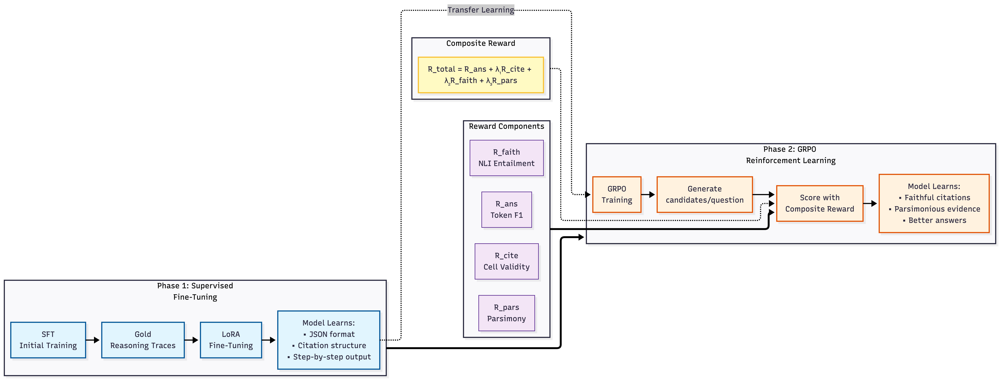

# RSAT: Structured Attribution Makes Small Language Models Faithful Table Reasoners

[](link-to-paper)
[](LICENSE)
[](https://www.python.org/)

**RSAT** trains small language models (1–8B) to produce step-by-step reasoning over tables where each step explicitly cites the table cells it depends on. The method achieves **3.7× faithfulness improvement** over SFT alone across six models from two architecture families.

<p align="center">
  
</p>

## Key Results

| Model | Method | F1 ↑ | Citation ↑ | Faithfulness ↑ | Parsimony ↑ | Format% ↑ |
|-------|--------|------|-----------|---------------|------------|-----------|
| Qwen 7B | SFT | 0.576 | 1.000 | 0.234 | 0.888 | 1.000 |
| Qwen 7B | **RSAT** | **0.619** | **0.992** | **0.977** | **0.992** | **0.992** |
| Llama 8B | SFT | 0.555 | 0.996 | 0.288 | 0.830 | 0.998 |
| Llama 8B | **RSAT** | **0.647** | **1.000** | **0.972** | **1.000** | **1.000** |

> See the paper for full results across all six models.

## How It Works

**Phase 1 — SFT:** Fine-tune on 1,000 verified reasoning traces → teaches JSON format, citation structure, step-by-step output (~99% format success, but only ~22% faithfulness).

**Phase 2 — GRPO:** Reinforcement learning with a composite reward → teaches faithful attribution, concise evidence selection, and answer quality.

The composite reward:
```
R = R_ans + 0.3·R_cite + 0.5·R_faith + 0.2·R_pars + R_fmt
```
where **R_faith** (NLI entailment between cited cells and step text) is the critical signal.

## Repository Structure

```
rsat/
├── configs/                        # Per-model YAML configs
│   ├── qwen_1.5b/                  # sft_config.yaml, grpo_config.yaml, eval_config.yaml
│   ├── qwen_3b/
│   ├── qwen_7b/                    # + ablation configs (grpo_no_*.yaml)
│   ├── llama_1b/
│   ├── llama_3b/
│   └── llama_8b/                   # + ablation configs
├── src/
│   ├── data/
│   │   ├── data_formats.py         # Table, ReasoningStep, RSATOutput classes
│   │   ├── generate_sft_data.py
│   │   ├── prepare_wtq.py
│   │   ├── prepare_fetaqa.py
│   │   └── prepare_tabfact.py
│   ├── training/
│   │   ├── sft_train.py            # Phase 1: LoRA SFT
│   │   └── grpo_train.py           # Phase 2: GRPO with composite reward
│   ├── rewards/
│   │   ├── composite_reward.py
│   │   ├── answer_reward.py        # Token F1
│   │   ├── citation_reward.py      # Cell bounds checking
│   │   ├── faithfulness_reward.py  # NLI entailment
│   │   └── parsimony_reward.py     # Over-citation penalty
│   ├── evaluation/
│   │   ├── evaluate.py             # Run eval across all methods
│   │   └── metrics.py              # F1, EM, faithfulness, parsimony
│   └── utils/
│       ├── table_utils.py          # Table serialization
│       └── groq_client.py          # Teacher model API
├── prompts/
│   └── all_prompts.yaml            # System prompts for all stages
├── scripts/
│   ├── run_all_experiments.sh      # Master runner (all 6 models × 4 methods)
│   └── run_ablations.sh            # Ablation experiments
├── tests/
│   └── test_rewards.py             # Unit tests for reward functions
├── data/                           # Created by data prep scripts
│   ├── sft/                        #   rsat_sft_{train,val}.jsonl
│   └── grpo/                       #   rsat_grpo_{train,val,test}.jsonl
├── results/                        # Created by evaluation
│   └── {model}/{method}/           #   eval_results.json + predictions.jsonl
└── requirements.txt
```

## Setup

```bash
git clone https://github.com/JugalGajjar/RSAT.git
cd RSAT
pip install -r requirements.txt
```

**Requirements:** Python 3.10+, PyTorch 2.0+, CUDA-compatible GPU (tested on NVIDIA H100 80GB).

Key dependencies:
- `transformers` ≥ 4.40
- `trl` == 0.29.0
- `peft` ≥ 0.10
- `sentence-transformers` (for NLI faithfulness scoring)
- `wandb` (optional, for logging)

## Quick Start

### 1. Prepare Data

```bash
# Download and process source datasets
python -m src.data.prepare_wtq
python -m src.data.prepare_fetaqa
python -m src.data.prepare_tabfact

# Generate SFT training data (requires teacher model API key)
python -m src.data.generate_sft_data
```

### 2. Train a Single Model

```bash
# Phase 1: SFT
python -m src.training.sft_train --config configs/qwen_7b/sft_config.yaml

# Phase 2: GRPO
python -m src.training.grpo_train --config configs/qwen_7b/grpo_config.yaml
```

### 3. Evaluate

```bash
# Evaluate all four methods (zero-shot, SFT, post-hoc, RSAT)
python -m src.evaluation.evaluate --config configs/qwen_7b/eval_config.yaml --output_dir results/qwen_7b/rsat_full
```

### 4. Run Everything

```bash
# All 6 models × 4 methods
bash scripts/run_all_experiments.sh

# Single model
bash scripts/run_all_experiments.sh qwen_7b

# Eval only (skip training)
bash scripts/run_all_experiments.sh qwen_7b eval_only

# Ablation experiments (Qwen 7B + Llama 8B)
bash scripts/run_ablations.sh
```

## Output Format

RSAT models produce structured JSON with cell-level citations:

```json
{
  "reasoning_steps": [
    {
      "step": "The Theatre World Award was won in 1996",
      "cited_cells": [[2, 0], [2, 1], [2, 4]]
    },
    {
      "step": "The award was for Rent",
      "cited_cells": [[2, 2]]
    }
  ],
  "answer": "Theatre World Award for Rent"
}
```

Cell coordinates are zero-indexed `[row, col]`, excluding the header row.

## Models

| Model | HuggingFace ID | Family | Parameters |
|-------|---------------|--------|------------|
| Qwen 1.5B | `Qwen/Qwen2.5-1.5B-Instruct` | Qwen 2.5 | 1.5B |
| Qwen 3B | `Qwen/Qwen2.5-3B-Instruct` | Qwen 2.5 | 3B |
| Qwen 7B | `Qwen/Qwen2.5-7B-Instruct` | Qwen 2.5 | 7B |
| Llama 1B | `meta-llama/Llama-3.2-1B-Instruct` | Llama 3 | 1B |
| Llama 3B | `meta-llama/Llama-3.2-3B-Instruct` | Llama 3 | 3B |
| Llama 8B | `meta-llama/Llama-3.1-8B-Instruct` | Llama 3 | 8B |

## Compute

All experiments run on a single NVIDIA H100 80GB GPU.

| | SFT | GRPO | Eval | Total |
|---|---|---|---|---|
| 6 main models | 68 min | 874 min | 165 min | **18.4 hrs** |
| 6 ablation runs | — | — | — | **18.3 hrs** |
| **Grand total** | | | | **36.8 hrs** |

## Datasets

| Split | WTQ | FeTaQA | TabFact | Total |
|-------|-----|--------|---------|-------|
| SFT train | 630 | 135 | 135 | 900 |
| SFT val | 70 | 15 | 15 | 100 |
| GRPO train | | (combined) | | 38,647 |
| GRPO val | | (combined) | | 16,624 |
| GRPO test | | (combined) | | 19,126 |
| **Total** | | | | **75,397** |

## Citation

```
To be updated.
```

## License

This project is licensed under the MIT License — see [LICENSE](LICENSE) for details.

## Acknowledgments

We thank the creators of [WTQ](https://ppasupat.github.io/WikiTableQuestions/), [FeTaQA](https://github.com/Yale-LILY/FeTaQA), and [TabFact](https://tabfact.github.io/) for the source datasets, and the [TRL](https://github.com/huggingface/trl) team for the GRPO implementation.
